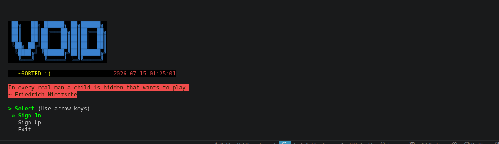
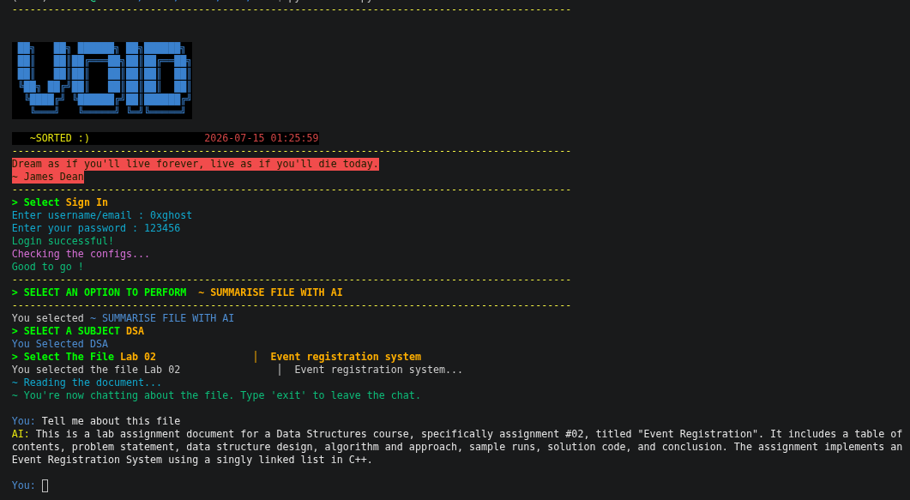

# VOID

A terminal-first workspace for managing your study files, straight from the command line. No browser tabs, no clutter — just you, your files, and a terminal that looks like it belongs in a hacker movie.

VOID lets you upload your notes, PDFs, and assignments to the cloud, organize them by subject, pull them back down whenever you need them, and even chat with an AI about the contents of a file to get quick summaries or answers. It's built for people who'd rather live in the terminal than dig through folders and cloud dashboards.

## What VOID actually does

- **Upload & store files** — push your notes and PDFs to secure cloud storage, tagged and sorted by subject
- **Download anytime** — pull a file back down directly to your machine, or grab a shareable link for it instead
- **AI-powered summaries** — VOID reads through your PDFs and hands you back a structured breakdown of what's inside, so you don't have to skim the whole thing yourself
- **Chat with your files** — ask questions about a specific file and get answers grounded in its actual content, not generic guesses
- **Delete cleanly** — remove files from both storage and your records in one go, with a confirmation step so nothing goes missing by accident
- **Account system** — your files are tied to your account and synced across every machine you run VOID on, so switching devices doesn't mean starting over
- **Subject-based organization** — set up your enrolled subjects once (stored per-account in the cloud), and everything you upload gets sorted under them automatically

<br>



<br>



<br>

## Installation

You'll need [Git](https://git-scm.com/downloads) and [Python 3.10+](https://www.python.org/downloads/) installed first. Both installers check for these and will tell you clearly if either is missing.

### Linux / macOS

Open a terminal and run:

```bash
curl -fsSL https://raw.githubusercontent.com/0xGhost63/VOID/main/install.sh | bash
```

### Windows

Open PowerShell and run:

```powershell
irm https://raw.githubusercontent.com/0xGhost63/VOID/main/install.ps1 | iex
```

Both scripts do the same thing under the hood:

1. Clone VOID into `~/.void-cli` (or `%USERPROFILE%\.void-cli` on Windows)
2. Copy the public config from `.env.example` → `.env` (Supabase publishable key + API URL — no secret AI keys on your machine)
3. Create an isolated Python `venv` and install dependencies
4. Register the `void` command so you can run it from anywhere

If your terminal doesn't recognize `void` right after installing, close it and open a fresh one — this lets your PATH changes take effect.

### Manual installation

If you'd rather not run a script off the internet (fair enough), you can set it up yourself:

```bash
git clone https://github.com/0xGhost63/VOID.git
cd VOID
cp .env.example .env
python3 -m venv venv
source venv/bin/activate      # Windows: venv\Scripts\activate
pip install -r requirements.txt
python main.py
```

You'll just need to re-run `git pull` and reinstall requirements manually whenever you want the latest version, since you're skipping the auto-update wrapper.

### Running it

Once installed, just type:

```bash
void
```

anywhere, from any directory. On first run you'll be asked to sign in or create an account, then set your subjects if the account is new. After that you'll land on the main menu where you can upload, download, summarize, chat with, or delete your files.

VOID checks for updates every time you launch it, pulling the latest version from GitHub automatically before it starts. That means you'll always be running the newest release without ever needing to reinstall or manually update anything — just close and reopen it.

## Using VOID

Once you're logged in, everything happens through the main menu. Use the arrow keys to move between options and Enter to select:

- **Upload File** — pick a file from your system, tag it with a subject (and edit tags manually if it's handwritten notes), and it gets stored
- **Download File** — browse your uploaded files by subject, then either download the file directly or grab a shareable link for it
- **Summarise File with AI** — select a file and VOID reads through it, figures out what kind of document it is, and hands you back a clean summary
- **Delete File** — pick a file to remove permanently; you'll be asked to confirm before anything actually gets deleted
- **Settings** — manage your enrolled subjects and other preferences

Every menu in VOID works the same way, so once you've navigated one, you already know how to use the rest of them.

## Troubleshooting

- **`curl: (22) The requested URL returned error: 404`** — you're on an old install URL, or GitHub hasn't updated yet. Use the exact commands above (`.../main/install.sh` and `.../main/install.ps1` at the **repo root**, not under `scripts/`).
- **`void: command not found`** — restart your terminal, or add `export PATH="$HOME/.local/bin:$PATH"` to `~/.bashrc` / `~/.zshrc` (the installer prints this if needed).
- **`ensurepip` / `venv` errors on Linux** — install the venv package, e.g. `sudo apt install python3-venv`, then re-run the installer.
- **Login fails repeatedly** — check your internet connection; VOID needs to reach Supabase. Also make sure `.env` exists in the install folder (re-running the installer recreates it from `.env.example` if missing).
- **AI summarise / chat fails** — those calls go through the hosted VOID web backend; you need network access, and you must be logged in (session token).
- **Windows Defender or antivirus flags the install script** — this is a common false positive for PowerShell scripts that download and run code. You can inspect [`install.ps1`](https://github.com/0xGhost63/VOID/blob/main/install.ps1) on GitHub before running it if you want to verify what it does first.

## Prefer not to install anything?

VOID also has a full web version, available at:

**[0xghost-void.vercel.app](https://0xghost-void.vercel.app/)**

It's a browser-based rebuild of VOID on FastAPI and Supabase, with AI-assisted uploads that auto-tag your PDFs by subject and type, per-file chat, a dashboard with usage stats, and a one-click export of all your data as a zip. Subjects are stored per-account in Supabase and are shared with the CLI for the same login — so what you set in Settings on either side stays in sync. It's a solid option if you're on a machine you don't want to install anything on, or just want to try VOID out before committing to the terminal version.

## Built with

Python, Supabase (auth + storage + per-user subjects), and Groq / Gemini via the VOID web backend for AI — plus a terminal UI that doesn't take itself too seriously.

## License / credit

Built by [0xGhost63](https://github.com/0xGhost63).
